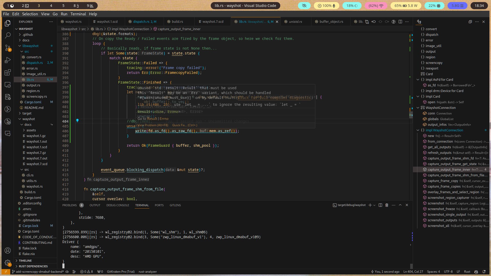

---
tags:
- gsoc
- devlog
---
# GSoC Devlog (May)   
   
This was my first month as a [Google Summer of Code](../GSOC/GSOC.md) contributor at [Waycrate](https://waycrate.github.io/index.html) and I feel like I've made a pretty decent start. We had a few meetings with the mentors and fellow contributors and they seem cool.    
   
I have my college semester exams at the beginning of the coding period so I thought I would get started a bit early to offset that:   
# What have you been working on?   
   
## The MVP   
I decided to build a MVP of the project in order to gain a closer understanding of the problem. I was able to hack and slash my way to something working by referring to the code from [wl-screenrec](https://github.com/russelltg/wl-screenrec) and the official example client [here](https://gitlab.freedesktop.org/wlroots/wlr-clients/-/blob/master/screencopy-dmabuf.c?ref_type=heads) It may be found on    
   
Here's the first successful image captured using it:   
   
   
And no, it isn't supposed to look like that. The colors are all inverted because I messed up the color format modifiers somewhere, but yeah having this is a pretty good boost for my confidence and gives me a better idea of how the rest of the project would work.   
## Interfacing with the GPU   
I did not detail a important component in my proposal - namely how one should go about acquiring a handle to the GPU and manage buffers on it.    
   
For the MVP I used the [GBM crate](https://crates.io/crates/gbm)along with [drm-rs](https://crates.io/crates/drm)from the Smithay project to do this.   
drm-rs is used to obtain a handle to the GPU and gbm is used to allocate buffer objects on it.   
> [!question]- Wait, what's GBM?   
> Generic Buffer Manager - a low-level library that provides a mechanism for allocating buffers on the GPU. It's a part of the Mesa project and acts a sort of abstraction layer that handles the vendor-specific details of how graphics buffers need to be handled on different GPUs.    
    
 In the MVP I hardcoded my iGPU path and used it to open a drm-rs device. I used the device to create a buffer object with GBM using the parameters provided by screencopy.   
    
 Now with a initialized dmabuf to play with, it was a matter of interfacing with the existing screencopy infrastructure in libwayshot to use dmabufs instead of shared memory.   
### Questions and Concerns:   
   
 - A better way to obtain a GPU handle needs to be found. The [DRM lease](https://wayland.app/protocols/drm-lease-v1)protocol does seem to be exactly what we need. We need to have the DMA-BUFS on the same GPU the compositor is using for rendering for the sake of efficiency.    
- API Design: Need to decide what types libwayshot will export the dmabufs in. The MVP does not make any API changes, the data from the dmabuf is immediately written into a SHM object in order to not have to change the rest of wayshot's image processing infrastructure. Obviously this won't do for the actual project as the whole point is not copying the image data out of the GPU.   
	- libwayshot needs to export handles to the DMA-BUFS. How this is to be done will is something I will need to discuss with the maintainers and the waycrate GSoC mentors. We can export these as GBM Buffer Objects, wayland-rs wl-buffers or as EGL images.   
- What are the transformations and post-processing libwayshot should apply to the resulting image buffers?    
	- How does EGL fit into all of this? Presumably such transformations can be performed via OpenGL and we'll likely need EGL to interface between the GBM buffer objects and OpenGL.   
- Testing application: Some way of testing the API will be required, one that will show a difference if dmabufs are used instead of shm buffers.    
	- I have a plan for this: a wl-mirror clone that uses layer-shell to render outputs as a wallpaper. The advantage of this idea being that it's a fairly useful tool in it's own right with no direct equivalent in the ecosystem, there's also the fact that I'm moderately familiar with layer-shell after my attempts debugging issues with it in wayshot. Perhaps EGL may be used for rendering?   
   
## Updating the manpages   
Wayshot has been in the middle of a pretty big refactor for a while under the freeze-feat branch. The main highlight - it changes the cropping tool functionality to screenshot the image and then crop it rather than the other way around.   
   
> [!info] How is this implemented?   
> This wasn't immediately obvious to me so here's how it works - wayshot takes a fullscreen screenshot as usual and then displays this using a fullscreen top-layer overlay created via the layer-shell protocol. After this, slurp is used to select a subregion of this surface. Wayshot crops out this subregion from the image, closes the overlay and then it's business as usual. It's a pretty innovative solution and credits to [Andreas](https://github.com/AndreasBackx) for implementing it.    
   
There's also a lot of CLI UX improvements to bring the wayshot CLI in line with other unix tools.    
   
As a result of all of this, the project manpages and README examples were kinda hopelessly outdated so that had to be corrected: [Update documentation with changes in freeze-feat](https://github.com/waycrate/wayshot/pull/116)   
   
## Updating the Proposal   
I decided to convert the proposal's design sections into markdown so that I could post it here: [Project Design](../GSOC/Project%20Design.md)   
   
I have updated it with the insights gained from building the MVP and discussion with the mentors.   
